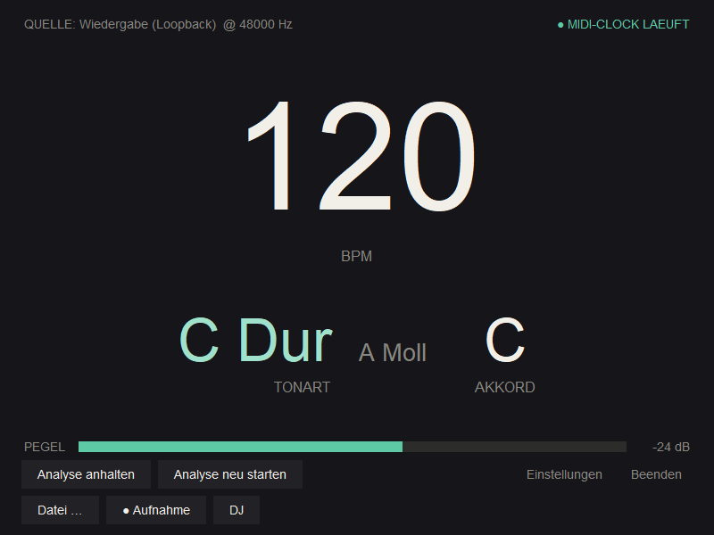

# AudioWizard


**Hört Musik mit und zeigt live Tempo, Tonart und Akkorde an – und liefert
dazu eine stabile MIDI-Clock, die Drumcomputer, Sequenzer, Arpeggiatoren und
Delays synchron zum laufenden Song taktet. Zusätzlich gibt es noch zahlreiche
andere Features wie z.B. die Erstellung von Songsheets oder Stems aus Audiodateien.**



Als Quelle dient wahlweise ein Audio-Eingang (Mikrofon/Line-In) oder unter
Windows direkt die **Wiedergabe selbst** (WASAPI-Loopback) – also z. B. das,
was gerade in Spotify läuft. Auf dem Raspberry Pi übernehmen die
PipeWire/Pulse-„Monitor“-Quellen dieselbe Rolle und erscheinen als normale
Eingänge; unter macOS leistet das ein virtuelles Ausgabegerät wie
[BlackHole](https://existential.audio/blackhole/).

## Inhalt

- [Überblick](#überblick) · [Typische Abläufe](#typische-abläufe)
- [Funktionen im Detail](#funktionen-im-detail)
- [Schnellstart (Windows)](#schnellstart-windows) · [macOS](#macos) ·
  [Raspberry Pi](#raspberry-pi-kiosk-betrieb) · [Webversion](#webversion-browser)
- [Wie es funktioniert](#wie-es-funktioniert) ·
  [Abhängigkeiten](#abhängigkeiten) · [Lizenz](#lizenz)

## Überblick

| Bereich | Was es tut |
|---|---|
| **Live-Analyse** | Tempo (BPM), Tonart und Akkorde aus Mikrofon/Line-In oder der laufenden Wiedergabe (Loopback). |
| **MIDI-Clock** | Driftfreie 24-PPQN-Clock zum Song; optional beat-synchron. |
| **Noten/Akkorde → MIDI** | Erkannte Tonhöhen live als MIDI senden (mono/poly/Akkord). |
| **Datei → MIDI-Clock** | Audiodatei mit driftfreier Clock abspielen, mit ▶ Start / ■ Stopp. |
| **Stems** | Gesang/Bass/Drums/Rest lokal trennen (Demucs) – exportieren oder abspielen. |
| **Song-Sheet** | Gesangstext + Akkorde im Ultimate-Guitar-Stil (lokal, Whisper + Forced Alignment). |
| **Stems → MIDI** | Bass/Rest/Gesang via Basic Pitch nach MIDI, je Kanal; optional MIDI-Clock mitsenden; als `.mid` speichern. |
| **Schlagzeug → MIDI** | Drums in Kick/Snare/HiHat (+ optional Tom/Crash) zerlegen, Note je Komponente frei wählbar; Standard GM-Drum-Map auf Kanal 10. |
| **MIDI-Datei laden** | Eine `.mid` spurweise (an/aus + Kanal) über den MIDI-Ausgang abspielen. |
| **Deluge-Song** | Aus den Stem-MIDI-Spuren eine Synthstrom-Deluge-Songdatei (`.XML`) erzeugen: Melodien als interne Synths, Drums als Kit; ganzer Song oder Takt-Loops. |
| **DJ-Modus** | Zwei Decks, Equal-Power-Crossfade; die Clock folgt dem Ziel-Deck. |
| **Aufnahme** | Live-Signal mitschneiden und als Datei(en) speichern. |

Eine Web-Variante (Browser, Web Audio + Web MIDI) deckt die Kernfunktionen ab –
siehe [Webversion](#webversion-browser).

## Typische Abläufe

- **Live mitspielen (Clock):** Quelle + MIDI-Ausgang wählen → **Start**. Die Clock
  startet mit der ersten Tempo-Schätzung und taktet Drumcomputer/Sequenzer mit.
- **Song-Sheet erstellen:** **Datei (Audio/MIDI) …** → Audiodatei → im Dialog
  **Song-Sheet** anhaken (Sprache fest wählen) → **Los**; Ergebnis als `.txt`/`.chordpro`.
- **Stems exportieren:** **Datei …** → **Stems exportieren**, Stem-Qualität **Hoch**
  → Zielordner.
- **Spuren → MIDI aufnehmen:** MIDI-Ausgang einstellen → **Datei …** →
  **Stems → MIDI** → im Stem-Player Spuren/Kanäle wählen, **MIDI-Clock mitsenden**
  an → **▶**; die DAW nimmt taktsynchron auf. Alternativ **MIDI speichern…** (`.mid`).
- **Schlagzeug → MIDI:** im Stem-Player **„Schlagzeug…"** → je Komponente Note wählen
  (Default GM-Drum-Map, Kanal 10), **Empfindlichkeit** justieren → **Anwenden**.
- **Datei als MIDI-Clock:** **Datei …** → nur **MIDI-Clock-Ausgabe** → **▶ Start / ■ Stopp**.
- **MIDI-Ausgang prüfen:** Einstellungen → **▶ MIDI-Ausgang testen** (Dreiklang hörbar?).

## Funktionen im Detail

- **Tempo (BPM)** – aus dem perkussiven Anteil des Signals (HPSS-Trennung),
  per Autokorrelation mit Kammfilter-Stützung und Oktav-Prior; Median über
  die letzten Schätzungen mit Schnellumschaltung bei echten Tempowechseln.
- **Tonart** – Salience-Chroma (CQT) mit Obertongewichtung, Sha'ath-Profile,
  Bass-Evidenz zur Unterscheidung von Dur und Mollparallele. Die Stimmung
  wird je Song geschätzt und eingefroren – auch gepitchtes Material landet
  auf den richtigen Tönen. Unsichere Erkennung wird gedimmt angezeigt.
- **Akkorde** (optional) – Template-Matching mit HMM-Glättung und
  Tonart-Prior; auf Wunsch ein schneller Pfad im eigenen Thread (~0,2-s-Takt)
  mit Onset-Verankerung und Innovations-Gate für kurze Wechsel-Latenz.
  Akkordfolgen lassen sich mit Zeitstempel in eine Textdatei protokollieren.
- **MIDI-Clock (24 PPQN)** – startet erst mit der ersten echten
  Tempo-Schätzung (`start`), stoppt bei Stille/Songwechsel (`stop`).
  Eigener Thread mit hoher Priorität und 1-ms-Timerauflösung, Tempo-Totband
  gegen Mess-Zittern, sanftes Aufholen statt Tick-Bursts. Optional
  **beat-synchron**: Tick 1 von 24 rastet auf die erkannte Zählzeit ein
  (sanfte Phasenregelung, gemessen ~1–2 ms Streuung).
- **MIDI-Ausgang prüfen** – im Einstellungsbildschirm sendet **„MIDI testen"** eine
  kurze, hörbare Testsequenz (MIDI-Start + 1 Takt Clock + Dreiklang C-E-G-C + Stop)
  an den gewählten Ausgang und meldet, wie viele Nachrichten rausgingen – so lässt
  sich verifizieren, ob der Ausgang den Klangerzeuger wirklich erreicht. In den
  MIDI-Fenstern (Stems→MIDI, MIDI-Datei) zeigt zudem ein **Live-Zähler „gesendet: N"**,
  dass während des Abspielens tatsächlich Daten fließen.
- **Noten-Modus (Pitch → MIDI)** (optional) – statt der Tempo-Analyse werden
  erkannte Tonhöhen direkt als MIDI gesendet: **monophon** (YIN, geringe Latenz,
  mit Halte-Hysterese gegen Neutrigger beim Ausklingen), **polyphon** (FFT-Peaks
  mit Oberton-Unterdrückung) oder **Akkorde** – aus dem Klang (z. B. Gitarre)
  wird der wahrscheinlichste Akkord erkannt und als sauberes MIDI-Voicing
  gesendet, Fehltöne fallen weg. In diesem Modus laufen die teuren
  Analyseschritte (HPSS/Chroma/Tempo/Clock) bewusst nicht mit – für möglichst
  geringe Latenz. Tracking-Parameter (Schwellen, YIN-Strenge, Entprellung,
  Polyphonie) sind kalibrierbar – in der GUI über „Noten-Kalibrierung …" im
  Einstellungsbildschirm (Slider), sonst über die Konfiguration. In Konsole und
  GUI wählbar; auch in der Webversion vorhanden.
- **Datei-Modus (Datei → MIDI-Clock, driftfrei)** (optional) – eine Audiodatei
  wird einmal vorab zu einer Beat-Map analysiert (globales Tempo → Beat-Tracker
  mit lokaler Periodenkurve, dadurch Erkennung von **konstantem vs. variablem**
  Tempo) und dann abgespielt. Die MIDI-Clock wird dabei nicht frei mitgetaktet,
  sondern streng aus der **Wiedergabeposition** abgeleitet (die Tick-Zeitpunkte
  stehen als feste Marken am Beat-Raster fest) – sie läuft daher nicht gegen den
  Song weg. Bei konstantem Tempo entsteht ein perfekt gleichmäßiges Raster über
  die ganze Datei. In der GUI über die Schaltfläche „Datei …" (auch im
  Einstellungsbildschirm), in der Konsole über `--file DATEI`. Mirror des
  gleichnamigen Modus der Webversion. Die Wiedergabe startet **nicht** von allein,
  sondern über einen **▶ Start / ■ Stopp**-Knopf – so beginnt die MIDI-Clock genau
  dann, wenn man es will (Stopp sendet ein MIDI-Stop; erneutes Start spielt von
  vorn).
- **Aufnahme + Speichern** (optional) – das live analysierte Signal lässt sich
  mitschneiden (GUI-Schaltfläche „● Aufnahme", Konsole Taste `r`) und danach als
  WAV speichern. Enthält der Mitschnitt **mehrere Stücke** (kurze Stille +
  BPM/Tonart-Wechsel), werden sie automatisch erkannt und in einer Prüf-Liste
  getrennt angeboten – jedes mit **Namensvorschlag aus BPM und Tonart**, unsichere
  Grenzen gedimmt; „Alle speichern" legt sie in einen Ordner, der für das nächste
  Mal gemerkt wird. Mirror der Webversion.
- **DJ-Modus** (optional) – zwei Decks nebeneinander laden und analysieren (auch
  während eines läuft), in **einem** Ausgabe-Stream gemischt. Ein Klick aufs Deck
  (oder der Crossfader) blendet per **Equal-Power-Crossfade** über; die MIDI-Clock
  **folgt automatisch dem lauteren Deck** (driftfrei aus dessen Wiedergabeposition,
  Tempowechsel beim Überblenden inklusive). In der GUI über die Schaltfläche „DJ",
  in der Konsole über `--dj DATEI_A DATEI_B` (Tasten `a`/`b` zum Überblenden).
  Mirror der Webversion. Je Deck gibt es zusätzlich einen **EQ-Isolator**
  (Bass/Mitte/Höhen stufenlos über senkrechte Slider regeln, mit dB-Wertanzeige
  und Doppelklick = zurück auf 0 dB – echtzeitfähige Frequenzfilterung als
  schlanker Stem-Ersatz, kein echtes Trennen einzelner Instrumente) und einen
  **Tempo-Sync** („Sync"): das Deck rastet **tonhöhen-erhaltend** auf das Tempo
  des anderen Decks ein (Beat-Phasen-Ausrichtung; die MIDI-Clock bleibt beim
  Überblenden konstant). Die Zeitdehnung läuft **in Echtzeit** (WSOLA, in der
  WebApp als AudioWorklet) und wirkt **sofort** – ohne Vorberechnung. Mit
  **„Übergang"** gleitet ein Deck stattdessen vom Master-Tempo allmählich auf
  sein **Eigentempo**; die WSOLA-Rate wird live gerampt und die MIDI-Clock
  gleitet automatisch mit.
- **Stem-Trennung (lokales KI-Modell)** (optional) – ein Stück lässt sich lokal
  und offline per **Demucs** (`htdemucs`) in **Drums, Bass, Gesang, Rest**
  zerlegen. Im **DJ-Modus** trennt die Schaltfläche „Stems" je Deck und öffnet
  einen Stem-Mischer (Pegel je Instrument, **in Echtzeit** mischbar – echte
  Instrument-Isolation statt bloßer Frequenzfilterung; lässt sich mit dem
  Tempo-Sync kombinieren). Außerhalb des DJ-Modus läuft alles über **einen
  gemeinsamen Dialog „Was soll passieren?"**: nach dem **Laden einer Datei** oder
  nach einer **Aufnahme** lassen sich **MIDI-Clock-Ausgabe, Stem-Export, Stems
  abspielen** (zusammen/getrennt, im **Stem-Player** mit Pegel-Fadern je Spur,
  **⏮ Anfang** zum Neustart und **„💾 Stems speichern…"** – einzelne oder alle
  Spuren als WAV, optional gleich **auf Takt geschnitten**, siehe unten),
  **Bass → MIDI** (siehe unten) und
  **Song-Sheet** beliebig **kombinieren** – die teure KI-Trennung läuft dabei nur
  **einmal** für alle gewählten Aktionen, und eine Aufnahme muss nicht erst als
  Datei gespeichert werden. Im Dialog lässt sich die **Stem-Qualität** wählen:
  **Automatisch** (Standard) trennt schnell, wenn nur ein Song-Sheet entsteht
  (Text/Akkorde sind robust gegen kleine Trennartefakte), und in **voller
  Qualität**, sobald die Stems als **Audio exportiert/abgespielt** oder zu **MIDI**
  gewandelt werden; man kann auch fest „Hoch" oder „Schnell" erzwingen. Für die
  geringste **Übersprechung** zwischen den Spuren gibt es zusätzlich **„Maximum"**:
  das nutzt das **fine-tuned Modell `htdemucs_ft`** plus den **Shift-Trick**
  (Test-Time-Augmentation) – hörbar saubere Bass-/Drum-Stems, aber **~4–8× langsamer**
  und beim ersten Mal **~1 GB Modell-Download**. **„Maximum+"** verdoppelt den
  Shift-Trick (`shifts=2`) – noch etwas sauberer, nochmal deutlich langsamer.
  **„Ultra"** nutzt die **2026-SOTA-Modelle (Mel-Band-RoFormer)** als **Kaskade**:
  RoFormer entfernt zuerst den Gesang in Top-Qualität, dann trennt Demucs das
  **vokalfreie** Instrumental in Drums/Bass/Rest (am deutlichsten **sauberere
  Vocals**; Bass/Drums dadurch moderat besser). Ultra ist **optional** und braucht
  `pip install "audio-separator[cpu]"` **plus FFmpeg** im PATH; ohne GPU ist es
  **extrem langsam** (auf CPU eher für Einzel-Tracks/Übernacht-Render). Zum
  **schnellen Antesten** einer Stufe gibt es die Dialog-Option **„Schnelltest – nur
  die ersten N Sekunden verarbeiten"**: die Trennung läuft dann nur über einen kurzen
  Ausschnitt (z. B. 30 s), sodass man die Qualität in Minuten hört. Für die
  **Sample-Nutzung** gibt es die Export-Option **„Stems auf Takt schneiden"**: dann
  werden alle exportierten Stems **gemeinsam** so geschnitten, dass der Start
  **exakt 2 Takte vor dem ersten Downbeat** liegt (4/4) – ein **Auftakt** liegt damit
  im Vorlauf, die „1" sitzt genau auf Takt 3 (beginnt das Stück zu früh, wird vorne
  mit Stille auf den Taktanfang aufgefüllt); das Ende bleibt unverändert. Das Tempo
  wird oktav-eindeutig geschätzt, die Downbeat-Lage ist heuristisch – kurz
  gegenprüfen. In der Konsole exportiert `--stems DATEI [--out ORDNER]`
  die Spuren als einzelne WAVs. Braucht das zusätzliche Paket **`demucs`**
  (`pip install demucs`, zieht PyTorch); ohne bleibt das Feature einfach aus. Die
  KI-Trennung läuft offline und kann je nach CPU einige Minuten je Stück dauern.
  Während der Trennung öffnet sich ein eigenes **Fortschritts-/Log-Fenster**: es
  zeigt live, welcher Schritt gerade läuft (Modell laden, Audio laden, Trennung,
  Speichern) und im Fehlerfall die **vollständige Fehlermeldung** – so lässt sich
  beurteilen, was passiert. Das Laden der Audiodatei läuft bewusst **über librosa**
  statt über torchaudio; dadurch funktioniert die Trennung auch dann, wenn die
  Installation kein `torchcodec` mitbringt (neuere torchaudio-Versionen verlangen
  es zum Laden) oder die `demucs.api` fehlt – ist die installierte Demucs-/
  PyTorch-Version unvollständig, weicht das Programm automatisch auf einen anderen
  Weg aus.
- **Stems → MIDI (Basic Pitch)** (optional) – wird im Dialog „Was soll passieren?"
  **Stems → MIDI** gewählt, wandelt **Basic Pitch** (Spotify) die getrennten
  **tonalen** Spuren (**Bass, „Rest", Gesang**) in MIDI-Noten um. Im **Stem-Player**
  gibt es dann einen **MIDI-Bereich**: pro Spur **an/aus** und ein **frei wählbarer
  MIDI-Kanal** (1–16), ein **Master-Schalter** (Start/Stopp der ganzen MIDI-Ausgabe,
  auch während des Abspielens) sowie ein **Mindestnoten-Regler** (Dichte; „Anwenden"
  rechnet auf den schon getrennten Stems neu, ohne erneute KI-Trennung). Die Noten
  laufen **synchron zur Wiedergabe** über den in den Einstellungen gewählten
  **MIDI-Ausgang** – pausiert man die Stems, schweigt auch das MIDI, ein Positions-
  sprung synchronisiert sauber neu. Optional lässt sich eine **MIDI-Clock mitsenden**
  (24 PPQN, folgt dem Tempo): beim Start wird ein **MIDI-`start`** gesendet (bzw.
  `continue` mitten im Stück) und am Ende `stop` – so kann ein angeschlossener
  Sequenzer/DAW die gesendeten Noten **taktgenau mitschneiden**. Mit **„MIDI speichern…"** lässt sich eine
  **mehrspurige MIDI-Datei** aller aktuell aktiven Spuren (je eigener Kanal)
  exportieren, um später daran weiterzuarbeiten. Braucht `basic-pitch` **und** einen
  eingestellten MIDI-Ausgang; auf Windows/Python 3.12 ohne TensorFlow installieren
  (siehe `requirements.txt`: `--no-deps` + `onnxruntime`). Der **Drums-Stem** läuft
  nicht über Basic Pitch (tonlos), sondern über einen eigenen Weg – siehe nächster
  Punkt.
- **Schlagzeug → MIDI** (optional) – der **Drums-Stem** wird per **band-weiser
  Onset-Erkennung** je Schlagzeug-Komponente in MIDI-Schläge gewandelt: für **Kick,
  Snare, HiHat** (zuverlässig) und optional **Tom** sowie **Crash/Becken**
  („best effort", standardmäßig aus) wird in einem eigenen **Frequenzband** nach
  Anschlägen gesucht – so werden auch **gleichzeitige** Schläge (z. B. Kick + HiHat)
  sauber getrennt. Eine **Kick-Dominanz-Sperre** verhindert Phantom-Snares durch den
  breitbandigen Kick-Anschlag. Über den Knopf **„Schlagzeug…"** im Stem-Player öffnet
  sich ein **eigenes Fenster**: je Komponente **an/aus** und **frei wählbare
  MIDI-Note** (vorbelegt mit der **General-MIDI-Drum-Map**, Kick 36 / Snare 38 /
  HiHat 42 …), ein **▸ Test**-Knopf je Zeile, der die Note kurz auf dem Drum-Kanal
  sendet (so prüfst du, ob sie das richtige Instrument am Gerät triggert), plus ein
  **Empfindlichkeits-Regler**. Die Drums laufen als eigene Spur
  (Standard **Kanal 10**, GM-Schlagzeug) **synchron** mit, lassen sich an-/abschalten
  und gemeinsam mit den anderen Spuren in die **MIDI-Datei** exportieren. Braucht
  **keine** Zusatzbibliothek (nur `librosa`). Hinweis: Kick/Snare/HiHat sitzen gut;
  Tom, Crash, Ride, Ghost-Notes und schnelle Wirbel sind heuristisch und können
  über-/untertriggern – dafür gibt es den Empfindlichkeits-Regler und das An/Aus.
- **MIDI-Datei laden & instrumentenweise abspielen** – über „Datei laden …" lässt
  sich auch direkt eine **`.mid`-Datei** öffnen (z. B. eine zuvor exportierte). Sie
  wird **spurweise** über den eingestellten MIDI-Ausgang abgespielt: Transport
  (▶/⏸, ⏮ Anfang) plus **pro Spur an/aus und frei wählbarer Kanal** – so kann man
  einzelne Instrumente stummschalten oder umrouten, ohne alles neu zu erzeugen.
  Bei **Schlagzeug-Spuren** (GM-Kanal 10) gibt es **„Schlagzeug-Noten…"**: je
  vorhandener Tonhöhe eine **neue Note** wählen (+ **▸ Test**) – so lassen sich die
  Komponenten auch in einer **bereits gespeicherten** Datei noch umlegen (eine
  Neuerkennung aus Audio ist dann nicht mehr möglich, nur das Verschieben der
  Tonhöhen). Reine MIDI-Ausgabe (kein Audio); braucht nur einen MIDI-Ausgang.
- **Deluge-Songdatei erzeugen** – im Stem-Player (bei „Stems → MIDI") gibt es
  **„Deluge-Song…"**: daraus entsteht eine **Synthstrom-Deluge-Songdatei** (`.XML`,
  Community-Firmware c1.2.x) – jede aktive Stem-Spur wird ein **Pattern**: die
  **melodischen** Stems (Bass/Rest/Gesang) als **interne Synth-Spuren**, das
  **Schlagzeug** als **Kit** (Standard-808-Slots Kick/Snare/HiHat …). Wählbar:
  **ganzer Song** (ein Clip je Spur) oder **Takt-Loops** (kurze Pattern zum
  Arrangieren). Tempo, Notenlängen, Velocity und die Takt-Lage werden übernommen
  (96 Ticks/Viertel). Die fertige `.XML` in den **SONGS**-Ordner der SD-Karte legen.
  Hinweis: Das Kit referenziert das **Factory-808-Kit** – diese Samples müssen auf
  der SD-Karte liegen, sonst lädt der Song zwar, die Drums bleiben aber stumm.
  (Format inkl. Noten-Encoding/Tempo wurde gegen eine echte c1.2.1-Datei verifiziert
  und auf dem Gerät getestet.)
- **Song-Sheet (Text + Akkorde)** (optional) – aus einer Datei entsteht ein
  **Chord-Sheet wie bei Ultimate Guitar**: die Akkorde stehen über den jeweiligen
  Wörtern des gesungenen Textes. Ablauf komplett **lokal/offline**: Demucs trennt
  zuerst den **Gesang** heraus (das verbessert die Transkription deutlich), eine
  lokale **Whisper-KI** transkribiert den Gesang mit Wort-Zeitstempeln, und die
  **Begleitung** (alles außer Gesang) geht in die **Akkord-Erkennung** (über je
  zwei Beats ein Akkord). Den **Grundton** liefert dabei der **getrennte
  Bass-Stem** – ein sauberes Bass-Signal, das tonverwandte Akkorde sicher
  unterscheidet (C vs. Am, G vs. Em) und so die häufigste Fehlerkennung behebt;
  fürs Sheet werden bewusst **nur Dur-/Moll-Dreiklänge** zugelassen (Septakkorde
  flackern auf der gesangslosen Begleitung) und leitereigene Akkorde der
  erkannten Tonart leicht bevorzugt. Aufgerufen über den **„Was soll passieren?"-Dialog** beim Laden
  einer Datei bzw. nach einer Aufnahme (er fragt auch **Sprache** und
  **Modellgröße** ab) bzw. `--sheet DATEI [--out ORDNER]
  [--lang de|en] [--whisper small|medium|large-v3]` in der Konsole. Das Ergebnis
  wird in einem Fenster angezeigt und lässt sich als **Textdatei** und als
  **ChordPro** (`.chordpro`, transponier-/druckbar) speichern. Da Whisper die
  gesungenen Wortanfänge je nach Lauf mal etwas früh/spät markiert, lässt sich der
  **Akkord-Versatz im Fenster live nachregeln** („◀ Akkorde früher / später ▶") –
  so sitzen die Akkorde exakt über den richtigen Silben. Standardmäßig werden die
  Akkorde **um etwa einen Beat nach vorne** gezogen (tempoabhängig): die Erkennung
  arbeitet auf einem 2-Beat-Raster und verortet den Akkord am Fensteranfang,
  wodurch er ohne Korrektur rund einen Beat zu spät über der Silbe stünde – gemessen
  (wortgenau gegen handkorrigierte Sheets) hebt dieser beat-relative Vorlauf die
  Trefferquote deutlich (z. B. ~40 % → ~80 %). Das Sheet-Fenster hat
  außerdem eine eigene **Start/Stopp-Wiedergabe** (▶/⏸, ⏮ Anfang) und markiert beim
  Abspielen die aktuelle Stelle **wortgenau** (Karaoke-Mitlauf): die laufende Zeile
  wird hervorgehoben und mitgescrollt, das gerade gesungene Wort zusätzlich betont –
  so kann man Text und Akkorde direkt mitlesen/mitspielen.
  Braucht zusätzlich **`faster-whisper`** (`pip install faster-whisper`; lädt beim
  ersten Mal ein Sprachmodell) sowie `demucs`; ohne bleibt das Feature aus. Es
  wird ein **mehrsprachiges** Modell genutzt (Deutsch und Englisch gleichermaßen),
  Standard ist „medium". Ist zusätzlich **`whisperx`** installiert
  (`pip install whisperx`), wird automatisch **Forced Alignment** (wav2vec2)
  genutzt: faster-whisper liefert den Text **und die Phrasen-Zeilen** (sauber
  geschnitten, eine Phrase pro Zeile), WhisperX richtet die **Wörter präzise**
  daran aus – so sitzen die Akkorde genauer über den richtigen Silben **und** das
  Sheet bleibt gut lesbar. Beim ersten Lauf je Sprache lädt WhisperX einmalig ein
  ~300–400 MB großes Ausrichtmodell (Fortschritt steht im Log); danach aus dem
  Cache. Ohne whisperx laufen die reinen Whisper-Zeiten (gröber, dafür mit dem
  Versatz-Regler justierbar). **Tipp:** Bei bekanntem Gesang die Sprache fest wählen –
  die automatische Spracherkennung liegt bei Musik gern daneben (ein deutsches
  Lied wird sonst als Englisch „übersetzt"). Hinweise: gesungener Text wird „gut,
  aber nicht fehlerfrei" erkannt, die Akkorde sind eine Approximation (kein
  Profi-Transkriptor), und der Lauf kann je nach CPU einige Minuten dauern (eher
  ein PC- als ein Pi-Feature).
- **Zwei Oberflächen** – Konsolen-Version (`realtime_bpm_key_midiclock.py`)
  und Touch-taugliche Kiosk-GUI (`bpm_key_display.py`) für ein 7-Zoll-Display
  am Raspberry Pi; unter Windows und macOS läuft sie im Fenster.
- **Praxis-Helfer** – Hold-Funktion für Stücke mit langen Breaks (Anzeige
  friert ein, Clock läuft konstant weiter), manueller Analyse-Neustart für
  Songwechsel ohne Pause, Pegelanzeige, Watchdog und Logdatei für den
  Kiosk-Betrieb.

## Schnellstart (Windows)

```
pip install -r requirements.txt
python bpm_key_display.py
```

Beim ersten Start erscheint der Einstellungsbildschirm: Audio-Quelle (auch
„Loopback: …“-Einträge zum Mithören der Wiedergabe) und MIDI-Ausgang wählen,
Start drücken. Die Wahl wird gespeichert, danach startet das Programm direkt
in die Anzeige. Alternativ die Konsolen-Version:

```
python realtime_bpm_key_midiclock.py
```

Eine Audiodatei statt einer Live-Quelle abspielen (Datei-Modus, driftfreie
Clock zur Wiedergabe) – in der Konsole:

```
python realtime_bpm_key_midiclock.py --file "C:\Pfad\zum\song.mp3"
```

Für die MIDI-Ausgabe an Software auf demselben Rechner braucht es unter
Windows einen virtuellen MIDI-Port, z. B.
[loopMIDI](https://www.tobias-erichsen.de/software/loopmidi.html).

## macOS

```
python3 -m pip install -r requirements.txt
python3 bpm_key_display.py
```

Läuft wie unter Windows im Fenster; Bedienung und Konsolen-Version sind
identisch. Drei Besonderheiten:

- **Mikrofon-Berechtigung:** Beim ersten Zugriff auf einen Audio-Eingang
  fragt macOS nach der Mikrofon-Freigabe für das Terminal (bzw. die
  Python-App) – einmal erlauben.
- **MIDI-Ausgang:** In der MIDI-Liste gibt es den Eintrag „Virtueller Port
  ‚AudioWizard Clock‘ erzeugen“ (CoreMIDI) – der Port erscheint dann in der
  DAW als MIDI-Eingang, ganz ohne IAC-Treiber. Alternativ funktioniert
  natürlich auch der IAC-Bus aus dem Audio-MIDI-Setup oder ein
  USB-MIDI-Interface.
- **Wiedergabe mithören:** WASAPI-Loopback gibt es nur unter Windows. Auf
  dem Mac ein virtuelles Ausgabegerät wie
  [BlackHole](https://existential.audio/blackhole/) installieren (kostenlos),
  die Wiedergabe dorthin routen (z. B. per „Gerät mit mehreren Ausgängen“
  im Audio-MIDI-Setup, damit weiterhin etwas zu hören ist) – BlackHole
  erscheint dann als normaler Audio-Eingang in der Quellenliste.

## Raspberry Pi (Kiosk-Betrieb)

Installation (mit Desktop oder als Minimal-Variante auf Pi OS Lite),
Kiosk-Autostart, Overlay-Dateisystem für den Bühnenbetrieb (robust gegen
hartes Ausschalten) und Performance-Tipps stehen in
[README_RaspberryPi.md](README_RaspberryPi.md).

## Webversion (Browser)

Eine schlanke Browser-Variante ohne Installation liegt als **einzelne Datei**
in [webapp/index.html](webapp/index.html): BPM-Erkennung mit stabiler
MIDI-Clock und optionaler Tonart-Anzeige über die Web Audio und Web MIDI API
(Chrome/Edge). Als Quelle dient ein Audio-Eingang oder die mitgehörte
Wiedergabe (Tab-/System-Audio über die Screen-Capture-API). Zusätzlich gibt es
einen **Datei-/Aufnahme-Modus**, der eine Audiodatei – oder einen Mitschnitt
(mitgehörte Wiedergabe oder Audio-Eingang, manuell aufgenommen) – vorab zu einer
Beat-Map analysiert und ihre MIDI-Clock **driftfrei** zur Wiedergabe ausgibt; die
Aufnahme lässt sich – auch in mehrere erkannte Stücke getrennt – als Datei mit
BPM/Tonart-Namensvorschlag speichern. Außerdem gibt es
einen **Noten-Modus** (Pitch → MIDI, mono-/polyphon), einen
**Akkord-Modus**, der angeschlagene Akkorde (z. B. Gitarre) erkennt und als
sauberen MIDI-Akkord sendet, sowie einen **DJ-Modus** (zwei Decks nebeneinander,
Audio-Crossfade, MIDI-Clock folgt dem überblendeten Track). Einfach im Browser
öffnen – kein Server nötig.

👉 **Online ausprobieren:** <a href="https://codekoch.github.io/AudioWizard/webapp/">https://codekoch.github.io/AudioWizard/webapp/</a>

Details in [webapp/README.md](webapp/README.md).

## Wie es funktioniert

Die Analyse läuft auf einem rollenden 8-Sekunden-Fenster, das jede Sekunde
neu ausgewertet wird (librosa, 22 050 Hz):

1. **HPSS-Zerlegung** trennt das Signal nach Struktur: kurze, breitbandige
   Transienten (Drums) gehen in die Tempo-Schätzung, der harmonische Rest
   (Flächen, Bass, Gesang) in Tonart und Akkorde.
2. **Tempo**: Autokorrelation der Onset-Hüllkurve, jeder Kandidat wird durch
   seine Vielfachen und das Achtelraster gestützt (Kammfilter); ein sanfter
   Prior löst die Oktav-Mehrdeutigkeit. Schwache Periodizität wird verworfen
   statt geraten.
3. **Tonart**: Chroma aus einer 7-Oktaven-CQT mit Obertongewichtung
   (Salience) und Log-Kompression, korreliert mit Dur-/Moll-Profilen;
   ein Bass-Chroma liefert die Grundton-Evidenz. Zweistufige Mittelung
   (schnelle EMA + Gesamtmittel) plus Hysterese gegen Flackern.
4. **MIDI-Clock**: eigener Echtzeit-Thread, der dem Tempo-Median mit
   Totband und begrenzter Slew-Rate folgt; im Beat-Sync-Modus zieht eine
   Regelschleife die Tick-Phase mit max. 1,5 ms pro Tick auf das geglättete
   Beat-Raster.

Viele Stellschrauben sind direkt im Quelltext dokumentiert – inklusive der
Messwerte, die zur jeweiligen Einstellung geführt haben, und der Ansätze,
die gemessen und verworfen wurden.

## Qualität ist nachmessbar

- `eval_detection.py` – nach wie vielen Sekunden stehen BPM und Tonart
  dauerhaft korrekt? (Testdateien nach dem Muster `<BPM>BPM_<Tonart>.mp3`
  in den Projektordner legen; aus Urheberrechtsgründen liegen keine im Repo.)
- `eval_chords.py` – Diatonik-Quote und Wechselrate der Akkorderkennung,
  inklusive CPU-Zeit pro Analyse.
- `eval_clock_sync.py` – End-to-End-Test der MIDI-Clock gegen einen
  synthetischen Klicktrack: misst Phasen-Streuung und Tempo-Stabilität
  der Beat-Ticks.

## Abhängigkeiten

numpy, librosa, soundfile, sounddevice, mido, python-rtmidi – und nur unter
Windows zusätzlich soundcard für den Loopback (`requirements.txt`).
python-rtmidi nutzt je nach Plattform WinMM, CoreMIDI (macOS) oder ALSA.

## Lizenz

[GPL-3.0](LICENSE) – frei nutzbar und veränderbar; Weitergaben (auch
veränderte) müssen unter derselben Lizenz quelloffen bleiben.

---

*Autoren: codekoch / claude · © 2026 codekoch*
