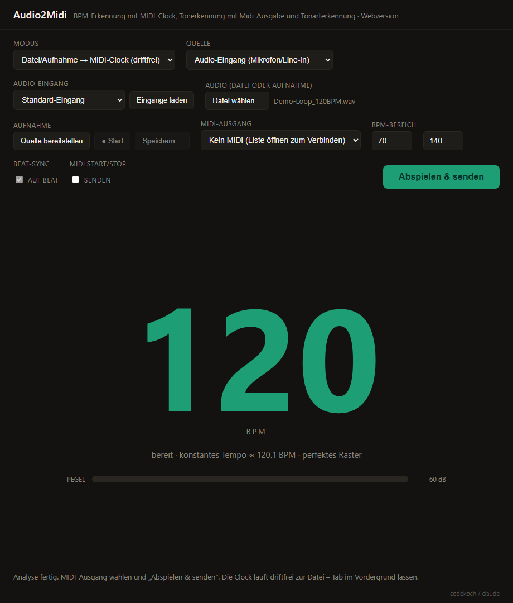

# Audio2Midi -- Webversion (BPM, MIDI-Clock & Tonart)

Eine schlanke Browser-Variante des Projekts: Tempo-Erkennung (BPM) mit
**stabiler MIDI-Clock-Ausgabe** (24 PPQN), optional auch die **Grundtonart**
(mit Paralleltonart). Ein **Datei-Modus** taktet eine geladene Audiodatei
**driftfrei** zur Wiedergabe (Offline-Beat-Map), ein **Noten-Modus** sendet
erkannte Tonhöhen direkt als MIDI-Noten (mono- oder polyphon). Als Quelle
dient ein Audio-Eingang **oder** die **mitgehörte Wiedergabe**
(Tab-/System-Audio). Keine Installation, kein Python, kein Server -- die ganze
App steckt in einer einzigen Datei: **`index.html`**.

> **Online ausprobieren:** <a href="https://codekoch.github.io/Audio2Midi/webapp/">https://codekoch.github.io/Audio2Midi/webapp/</a>

## Starten

- **Lokal:** `index.html` einfach im Browser öffnen (Doppelklick im
  Datei-Explorer oder im Browser `Strg`+`O`). Kein Server nötig.
- **Online:** über den GitHub-Pages-Link oben (siehe unten „Veröffentlichung").

Dann:

1. **Quelle** wählen: „Audio-Eingang" (Mikrofon/Line-In) oder „Wiedergabe
   mithören" (siehe Abschnitt unten). Bei „Audio-Eingang" zusätzlich
   **„Eingänge laden"** klicken und den Mikrofon-Zugriff erlauben – erst
   danach zeigt der Browser alle Eingänge **mit Namen** (Datenschutz) – und
   den gewünschten Eingang wählen.
2. **MIDI-Ausgang**: die Liste öffnen (fragt den MIDI-Zugriff an) und einen
   Port wählen, z. B. „loopMIDI Port". „Kein MIDI" zeigt nur an.
3. Optional **BPM-Bereich** anpassen (Standard 70–140) und über die Buttons
   **„Tonart"** bzw. **„Akkord"** die jeweilige Anzeige einblenden.
4. **Start** drücken.

Die große Zahl zeigt das erkannte Tempo; die MIDI-Clock startet automatisch
mit der ersten stabilen Schätzung (MIDI `start`) und hält bei Stille an
(`stop`).

**Tonart & Akkord (optional, parallel):** Über **„Tonart"** wird die Grundtonart
(mit Paralleltonart) eingeblendet, über **„Akkord"** zusätzlich der aktuell
erkannte Akkord daneben (gröberer Eindruck aus dem Vollmix; unsichere Erkennung
wird gedimmt). **Sind beide aus, läuft nur die BPM-Erkennung** – das spart die
teure Chroma-FFT und gibt maximale Performance (wichtig auf Handy/Raspberry Pi).

**Hold (Anzeige einfrieren):** Der Button **„Hold"** friert BPM/Tonart/Akkord
ein und lässt die **MIDI-Clock konstant weiterlaufen** – ideal für lange Breaks
oder Übergänge, in denen die Live-Analyse sonst „abreißen" würde. Erneuter Klick
setzt fort; die bisherige Tempo-/Tonart-Historie bleibt erhalten.

Über **„Modus"** stehen mehrere Betriebsarten zur Wahl: „Tempo & MIDI-Clock"
(live, oben beschrieben), „Datei/Aufnahme → MIDI-Clock (driftfrei)", die
Noten-Modi (monophon/polyphon/Akkorde) sowie der **DJ-Modus** (zwei Decks,
Audio-Crossfade, Clock folgt) – alle siehe unten.

## Datei/Aufnahme → MIDI-Clock (driftfrei)

Statt live mitzuhören lässt sich eine **Audiodatei laden** und ihre MIDI-Clock
**driftfrei** zur Wiedergabe ausgeben – ideal, wenn man zu einem fertigen Track
einen Drumcomputer/Sequenzer/Arpeggiator dauerhaft synchron laufen lassen will.

So geht's: Modus auf **„Datei/Aufnahme → MIDI-Clock (driftfrei)"** stellen, mit
**„Datei wählen…"** eine Audiodatei laden (oder per **„Aufnehmen"** mitschneiden,
siehe unten), MIDI-Ausgang wählen und **„Abspielen & senden"** drücken. Das Audio
wird hörbar abgespielt; Pegel, Position und Momentantempo werden angezeigt.

**Aufnehmen statt laden:** Audio lässt sich auch direkt aufnehmen und dann wie
eine Datei analysieren – so bekommt man auch ohne Datei (z. B. von einem Stream)
eine stabile Clock. Ablauf:

1. **Quelle wählen** (oben „Quelle"): **„Wiedergabe mithören"** (Tab/System)
   **oder** **„Audio-Eingang"** (Mikrofon/Line-In – Gerät über „Eingänge laden"
   wählen).
2. **„Quelle bereitstellen"** – bei „Mithören" erscheint **vor** der Aufnahme
   der Freigabe-Dialog, in dem Inhalt/Tab gewählt wird („Systemaudio/Tab-Audio
   teilen" ankreuzen).
3. **„● Start"** / **„■ Stopp"** – Aufnahme manuell starten und beenden. Danach
   wird sie automatisch analysiert (Beat-Map) und ist abspielbar.

Schon **ab „Quelle bereitstellen"** und während der Aufnahme laufen **Pegel,
BPM und Tonart** live mit (dieselbe Analyse wie im Clock-Modus, nur ohne MIDI) –
so sieht man sofort, ob Audio ankommt und was erkannt wird.

**Speichern (mit Namensvorschlag):** Nach der Aufnahme öffnet **„Speichern…"**
ein Panel. Die Aufnahme wird automatisch in **Stücke** zerlegt (Indiz: kurze
Stille + BPM/Tonart-Wechsel); jedes Stück erscheint mit **Start–Ende, Dauer,
BPM und Tonart** und einem **frei editierbaren Dateinamen** – vorbelegt aus
**BPM + Tonart** (z. B. `120BPM_C_Dur`). Unsichere Grenzen sind gedimmt
markiert. Du kannst jedes Stück einzeln oder **„Alle speichern"**, alles **„Als
ein Stück"** zusammenfassen oder **„Nach Zeit trennen…"** (feste
Minuten-Abstände). Format **WAV** (auch je Stück) oder **WebM-Original** (klein,
aber nur die **ganze** Aufnahme, da komprimierte Streams nicht verlustfrei
geschnitten werden können). Der Speichern-Dialog erlaubt freie Namens-/Ortswahl
(Chrome/Edge); **„Alle speichern" (WAV)** lässt einmal einen **Ordner** wählen
und legt alle Stücke dort ab. Der **zuletzt genutzte Ordner wird gemerkt** und
beim nächsten Speichern wieder vorgeschlagen.

Aufnahme/Mithören gibt es nur, wo der Browser es unterstützt
(Windows/Chrome/Edge mit Systemaudio, sonst Tab-Audio bzw. Audio-Eingang); auf
Android/Mobil ist die Aufnahme deaktiviert.

- **Einmalige Offline-Analyse:** Die Datei wird dekodiert und **vorab** zu
  einer Beat-Map analysiert (Onset-Hüllkurve → globales Tempo → lokale
  Tempokurve → DP-Beat-Tracking), mit Fortschrittsanzeige. Das passiert nur
  einmal beim Laden, nicht während der Wiedergabe.
- **Driftfreie Clock:** Jeder 24-PPQN-Tick wird gegen die laufende Web-Audio-
  Wiedergabe terminiert (Audio-Kontextzeit → `performance.now()` per
  `getOutputTimestamp()`, als MIDI-Zeitstempel ausgegeben). Es gibt **keine
  zweite, unabhängige Uhr** mehr, deren Fehler sich aufsummieren könnte – die
  Clock bleibt dauerhaft am Song.
- **Konstant vs. variabel – automatisch:** Konstantes Tempo (≤1,5 % Streuung)
  ergibt ein mathematisch perfektes Raster; bei variablem Tempo folgt die Clock
  den gemessenen Beat-Abständen. Der Status zeigt an, welcher Fall erkannt wurde.
- **Robust:** Sub-Frame-genaue Beat-Verfeinerung, oktav-fester Tempo-Prior
  (kein Halb-/Doppeltempo-Fehler), „24 Ticks pro Viertel" überbrücken einen
  übersprungenen Beat (kein kurzes Halbtempo), robuste Tempo-Anzeige.
- **MIDI optional:** Vorhören geht auch ohne MIDI-Ausgang. „MIDI Start/Stop ·
  senden" setzt – wenn aktiv – den `start` auf den ersten Beat (und `stop` am
  Ende). Der **BPM-Bereich** steuert die Analyse; ändert man ihn, wird die
  geladene Datei automatisch neu analysiert.

Im Datei-Modus werden Quelle, Audio-Eingang und Tonart ausgeblendet (sie sind
hier ohne Funktion). **Grenze:** groove-genau, nicht sample-genau – es bleibt
die übliche MIDI-Quantisierung von rund 1 ms. Den Tab im Vordergrund lassen.

## Noten-Modus (Pitch → MIDI)

Über **„Modus"** lässt sich von „Tempo & MIDI-Clock" auf einen Noten-Modus
umschalten, der erkannte Tonhöhen direkt als **MIDI-Noten** (Note On/Off) an
den gewählten Ausgang sendet. In diesem Modus laufen BPM-/Tonart-/Clock-
Schritte bewusst **nicht** mit – für möglichst geringe Latenz.

- **Monophon:** erkennt jeweils EINE Note (Gesang, Bass, Lead, einzelnes
  Instrument, Pfeifen) per YIN-Tonhöhenerkennung. Geringe Latenz, gute
  Treffsicherheit – braucht aber eine klar einstimmige Quelle.
- **Polyphon:** erkennt mehrere Noten gleichzeitig per harmonischer
  Salienz-Analyse mit **iterativer Oberton-Auslöschung** – die stärkste Note
  wird erkannt, ihre Obertonreihe aus dem Spektrum entfernt und neu gesucht,
  damit Obertöne (z. B. bei Gitarre) nicht als eigene Noten auftauchen. Etwas
  höhere Latenz und begrenzte Genauigkeit; bei dichter Musik ein grober
  Eindruck. Es werden alle erkannten Töne einzeln gesendet – auch
  Fehlerkennungen. Wer **saubere Akkorde** triggern will, nimmt den
  Akkord-Modus.
- **Akkorde:** erkennt aus dem Klang den **wahrscheinlichsten Akkord** und
  sendet ihn als sauberes MIDI-Voicing – ideal, um z. B. mit einer Gitarre
  MIDI-Akkorde zu triggern. Aus dem Spektrum wird ein Chroma (12 Tonklassen)
  gebildet und per **Template-Matching** (Cosinus-Ähnlichkeit gegen Dur-,
  Moll-, 7-, maj7-, m7-, sus- und dim/aug-Vorlagen, Grundton-Gewichtung)
  klassifiziert; ein Mehrheits-/Abstandskriterium verwirft Unklares. **Töne,
  die nicht zum Akkord gehören (meist Fehlerkennungen), fallen weg** – gesendet
  werden nur die Akkordtöne, als Grundstellung in der gespielten Lage. Der
  Akkord wird **gehalten**, bis sicher ein anderer erkannt wird oder es still
  wird (kein Geflacker). Angezeigt wird der **Akkordname** groß und darunter
  klein/grau in Klammern die gesendeten Noten (z. B. „E" mit „(E2 G#2 B2)").

Velocity wird aus dem Pegel abgeleitet, gesendet wird auf MIDI-Kanal 1.
Beim Stoppen/Umschalten werden alle offenen Noten beendet (Note Off).

Eine gehaltene Note bleibt über das Ausklingen **stehen** (Pegel-Hysterese +
entprelltes Note-Off), statt bei jedem kurzen Erkennungsaussetzer neu
getriggert zu werden. Mit **„Oktave ±"** lassen sich die erkannten Töne für
die MIDI-Ausgabe um ganze Oktaven nach oben/unten verschieben (z. B. eine
tief gespielte Bassline eine Oktave höher an einen Synth schicken).

### Kalibrierung (Tracking feinjustieren)

In den Noten-/Akkord-Modi blendet **„Kalibrierung"** ein Panel mit Schiebe-
reglern ein, die **sofort** (auch während des Spielens) wirken – ideal, um das
Tracking auf das eigene Instrument einzustellen, z. B. eine Gitarre an einen
mono­phonen Synth:

- **Latenz (Audioblock):** Größe des Audioblocks (256 / 512 / 1024 / 2048
  Samples ≈ 6 / 12 / 23 / 46 ms). Kleiner = schnellere Reaktion zwischen Spiel
  und gesendeter MIDI-Note, aber mehr CPU; sehr kleine Werte können das
  Tracking unruhiger machen. Das Tonhöhen-Fenster bleibt davon unberührt, die
  **Erkennungsqualität sinkt also nicht** – nur die Eingangs-Latenz. Standard
  512 (mono/poly) bzw. 1024 (Akkorde, etwas stabiler).
- **Anschlag-Schwelle:** ab welchem Pegel eine neue Note/ein Akkord startet
  (gegen Nebengeräusche/Übersprechen hochsetzen, für leises Spiel runter).
- **Halte-Schwelle:** wie weit ein ausklingender Ton fallen darf, bevor er
  losgelassen wird (mono/Akkord).
- **Note-Aus-Verzögerung:** wie viele leise Frames bis zum Note-Off – klein =
  knackiger/kürzer, groß = klebt länger (gut gegen Zappeln beim Ausklingen).
- **YIN-Schwelle (nur mono):** Strenge der Tonhöhenerkennung – kleiner =
  strenger (weniger Oktavfehler, aber verpasst evtl. leise Töne).
- **Wechsel-Reaktion:** wie schnell auf einen neuen Ton/Akkord umgeschaltet
  wird – 1 = sofort (geringste Latenz, aber empfindlicher), höher = stabiler.

Die Regler-Werte zeigen neben dem Frame-Wert die ungefähre Zeit in
Millisekunden (abhängig von der gewählten Latenz). **„Zurücksetzen"** stellt
die für den Modus sinnvollen Standardwerte wieder her.

## DJ-Modus (2 Decks, Clock folgt)

Über **„Modus" → „DJ (2 Decks, Clock folgt)"** lassen sich **zwei Tracks
nebeneinander** laden und mischen – die MIDI-Clock folgt automatisch dem Track,
zu dem übergeblendet wird.

- **Laden & analysieren:** Mit **„Datei A…"** und **„Datei B…"** je eine
  Audiodatei laden. Jedes Deck wird – wie der Datei-Modus – einmalig offline zu
  einer Beat-Map analysiert (BPM + Tonart werden angezeigt). Das geht **auch,
  während das andere Deck schon läuft**.
- **Abspielen & faden:** Je Deck mit **▶** starten (beide können gleichzeitig
  laufen). Übergeblendet wird mit dem **Crossfader**, den Tasten **„◀ A"/„B ▶"**
  oder per **Klick auf ein Deck** – das Audio wird (gleiche Leistung,
  equal-power) hörbar überblendet.
- **Clock folgt:** Die **MIDI-Clock** taktet driftfrei den Track, zu dem
  geblendet wird (ihre 24-PPQN-Ticks werden gegen dessen Wiedergabeposition
  terminiert). Sobald ein Deck dominiert (Crossfader über der Mitte), übernimmt
  die Clock dessen Tempo – das angeschlossene Gerät läuft also synchron zum
  gerade gehörten Track. Beim Wechsel passt sich das Tempo an (kein Beatmatch –
  die Clock springt auf das neue Songtempo).

Tipp: Den BPM-Bereich vor dem Laden grob passend setzen (steuert die Analyse).
Den Tab im Vordergrund lassen.

## Wiedergabe mithören (Loopback)

Statt eines Mikrofons lässt sich auch die laufende **Wiedergabe** analysieren
(z. B. was gerade in Spotify spielt). Quelle auf **„Wiedergabe mithören"**
stellen und **Start** drücken – dann erscheint der Freigabe-Dialog des
Browsers (Screen-Capture API, `getDisplayMedia`):

- **Windows, Chrome/Edge:** „**Gesamter Bildschirm**" wählen und unten
  **„Systemaudio teilen"** ankreuzen → die komplette Systemausgabe wird
  mitgehört (auch Desktop-Apps wie Spotify). Alternativ einen **Tab** wählen
  und **„Tab-Audio teilen"** ankreuzen (z. B. den Spotify-Web-Player).
- **macOS:** System-Audio ist hier nicht erfassbar – nur **Tab-Audio**
  (Spotify/YouTube als Browser-Tab). Safari unterstützt es nicht.
- **Android/Mobil:** **nicht möglich** – mobile Browser stellen
  `getDisplayMedia` nicht bereit. Die Option wird dort automatisch
  deaktiviert; als Quelle bleibt nur das Mikrofon. (Der Noten-Modus
  monophon funktioniert auf Android mit dem Mikrofon.)

Wichtig: Das Audio-Häkchen muss aktiv sein, sonst kommt kein Ton an (die App
weist dann darauf hin). Beendet man die Freigabe über die Browser-Leiste,
stoppt die Sitzung automatisch. Die Wiedergabe ist weiterhin normal hörbar.

## Voraussetzungen

- **Browser mit Web MIDI:** Chrome, Edge oder Opera (Chromium).
  Firefox unterstützt Web MIDI nur mit Erweiterung; **Safari unterstützt es
  nicht** – dort gibt es keine MIDI-Ausgabe (Anzeige funktioniert trotzdem).
- **Virtueller MIDI-Port**, um eine DAW/Hardware auf demselben Rechner zu
  erreichen: Windows
  [loopMIDI](https://www.tobias-erichsen.de/software/loopmidi.html),
  macOS der IAC-Treiber (Audio-MIDI-Setup), Linux ALSA/`snd-virmidi`.
  Ein USB-MIDI-Interface geht direkt.

## Warum die Clock stabil ist

Jeder Clock-Tick wird mit `output.send([0xF8], zeitstempel)` **im Voraus
geplant** – der Zeitstempel liegt in der `performance.now()`-Domäne, und das
MIDI-Subsystem des Browsers/Betriebssystems gibt den Tick dann zeitgenau aus.
Die Tick-Stabilität hängt damit nicht am (ungenauen) JavaScript-Timer,
sondern an der OS-MIDI-Schicht – derselbe Gedanke wie bei CoreMIDI auf dem
Mac. Ein Lookahead-Scheduler füllt die Tick-Warteschlange laufend ein Stück
in die Zukunft. Tempoänderungen werden mit Totband (gegen Mess-Zittern) und
begrenzter Slew-Rate sanft nachgeführt – kein Tick-Burst.

**Beat-Sync gegen Drift (optional):** Ohne Sync läuft die Clock im geschätzten
Tempo – das liegt aber oft minimal daneben (z. B. 120,1 statt 120 BPM), wodurch
sie nach einigen Takten hörbar vom Song wegdriftet. Mit aktivem **„Beat-Sync"**
(Standard an, in den Steuerelementen abschaltbar) wird die Clock laufend auf das
erkannte Beat-Raster nachgeführt:

- Aus einer **Phasenfaltung der Onset-Hüllkurve** eng ums geschätzte Tempo wird
  – über das ganze Analysefenster – die **echte Beat-Periode und -Phase** sehr
  genau bestimmt (gemessen <0,03 % Tempofehler bei klarem Beat); diese Periode
  dient als Clock-Rate, sodass kaum noch Drift entsteht.
- Zusätzlich wird der Beat-Tick (Tick 1 von 24) mit max. wenigen Millisekunden
  pro Beat sanft auf das Raster nachgezogen (Phasenregelung), was Restdrift
  laufend ausgleicht. Das Einrasten dauert nach dem Start ein paar Sekunden.

Eingerastet wird **nur bei deutlichem, kohärentem Beat** – bei undeutlichem
Rhythmus läuft die Clock einfach im zuletzt gemessenen Tempo frei weiter (kein
Reißen). Wer das nicht will (oder ungewöhnliches Material hat), schaltet
„Beat-Sync" ab; dann läuft die Clock wie zuvor im geglätteten Schätztempo.

**MIDI Start/Stop (Option):** Standardmäßig sendet die App **kein** Start/Stop,
sondern nur durchgehende Clock-Pulse – du startest dein Gerät selbst (auf den
gewünschten Taktanfang), die Clock hält dann das Timing. Wer das klassische
Verhalten will (Start mit der ersten Tempo-Schätzung, Stop bei Stille), hakt
„MIDI Start/Stop · senden" an.

**Tipp:** Den Tab im Vordergrund lassen. Hintergrund-Tabs werden vom Browser
gedrosselt; durch den Lookahead bleibt die Clock zwar eine Weile stabil,
für den Live-Betrieb sollte der Tab aber sichtbar bleiben.

## Tonart-Anzeige (optional)

Über den Button **„Tonart"** lässt sich die erkannte Grundtonart mit
Paralleltonart einblenden (z. B. „C Dur (A Moll)"). Die Erkennung ist aus dem
Python-Kern portiert: Sha'ath-Profile, Bass-Evidenz zur Unterscheidung von Dur
und Mollparallele, zweistufige Mittelung mit Hysterese; unsichere Erkennung
wird gedimmt angezeigt. Das Chroma stammt aus einer (für den Bass extra
hochaufgelösten) STFT statt der CQT des Python-Projekts.

## Technische Hinweise

- **`ScriptProcessorNode` statt `AudioWorklet`:** Der Worklet lädt ein Modul
  nach, was der Browser unter `file://` (Origin „null") blockiert. Der
  ScriptProcessor lädt nichts nach und läuft daher auch beim direkten Öffnen
  der Datei. Etwas älter/deprecated, für diese leichte Analyse aber völlig
  ausreichend; die MIDI-Clock ist davon ohnehin unabhängig.
- **MIDI-Clock-Timer im Hauptthread** (kein Blob-Worker – der wäre unter
  `file://` ebenfalls gesperrt). Tab sichtbar lassen.

## Grenzen gegenüber den Python-Versionen

- **Kürzere Geräteliste:** Der Browser zeigt eine *logische* Eingangsliste –
  einen Eintrag pro echtem Gerät. Die Python-App (PortAudio) listet dasselbe
  Interface mehrfach (MME, DirectSound, WASAPI, WDM-KS). Namen erscheinen erst
  nach der Mikrofon-Freigabe („Eingänge laden").
- **Mithören der Wiedergabe** ist möglich, aber über die Screen-Capture-API
  (siehe oben) statt eines WASAPI-Loopback-Geräts: Es muss pro Sitzung im
  Browser-Dialog freigegeben werden, und vollständiges **System-Audio gibt es
  nur unter Windows** (Chrome/Edge). Unter macOS nur Tab-Audio.
- **Vereinfachte Analyse:** Spektralfluss-Onset-Hüllkurve statt HPSS; Tonart
  aus STFT-Chroma statt CQT (etwas weniger treffsicher, vor allem bei der
  Dur/Moll-Unterscheidung). Eine separate Akkord-/HMM-Analyse wie im
  Python-Kern gibt es nicht; im Noten-Modus (polyphon) wird aus den erkannten
  Tönen lediglich ein Akkordname abgeleitet. Beat-Sync gibt es live als
  Phasenkopplung der Clock und im Datei-Modus als volle Offline-Beat-Map.

## Veröffentlichung über GitHub Pages

- Teste die Webversion direkt unter <a href="https://codekoch.github.io/Audio2Midi/webapp/">https://codekoch.github.io/Audio2Midi/webapp/</a>
